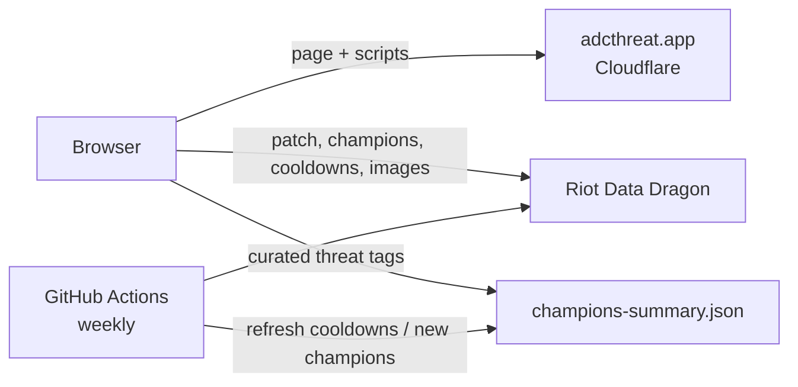

# ADC Threat

**A bot-lane matchup reference for League of Legends ADC players.**

[](https://adcthreat.app)
[](https://github.com/SamTesura/samtesura.github.io/actions/workflows/update-champion-data.yml)
[](LICENSE)

**Live:** <https://adcthreat.app> · **Mirror:** <https://samtesura.github.io> · **Author:** [Samuel Mendieta](https://samuelmendieta.com/)

---

## Contents

- [Overview](#overview)
- [Features](#features)
- [How it works](#how-it-works)
- [Technology](#technology)
- [Repository structure](#repository-structure)
- [Running locally](#running-locally)
- [Data maintenance](#data-maintenance)
- [Deployment](#deployment)
- [Documentation](#documentation)
- [Contributing](#contributing)
- [License and attribution](#license-and-attribution)

---

## Overview

ADC Threat is a single-page web tool. You select the ADC (the bot-lane damage carry) you are playing, then enter the enemy and allied champions. For each champion it shows:

- ability **cooldowns** for every rank, taken from the current game patch;
- **crowd-control (CC) classification**, meaning which abilities stun, root, knock up, suppress and so on, and whether *Cleanse* or *Quicksilver Sash (QSS)* can remove the effect;
- **threat badges** for things that matter to an ADC, such as gap-closers, stealth, shields and projectile blockers;
- a short **generated advice summary** for each enemy and ally.

The site is **static**: it's plain files with no server-side code and no database. It runs entirely in the visitor's browser.

## Features

| Area | Detail |
|---|---|
| Champion selection | 37 selectable ADCs (26 marksmen, 11 mages). Up to 5 enemies and 4 allies. Accent-insensitive autocomplete (`kaisa` finds *Kai'Sa*). |
| Live game data | Patch version, champion list, ability descriptions, cooldowns and portraits load at runtime from Riot's public **Data Dragon** service, so they always match the current patch. |
| Curated threat model | Every champion's abilities are hand-tagged (e.g. `KNOCKUP`, `STUN`, `GAP_CLOSE`) in `champions-summary.json`. Tags are ranked by danger and colour-coded. |
| Cleanse rules | Suppression → QSS only · Knock-ups, pulls and Nearsight → not fully removable · Stuns, roots, slows, charms, etc. → cleansable. |
| Patch notes link | Links directly to the official notes for the current patch. |
| Automated upkeep | A weekly GitHub Actions job refreshes cooldowns and ability names and detects new champions. |
| Responsive UI | Dark theme, works from phone width (≈320 px) up to ultrawide displays. |

## How it works



1. When the page loads, the browser asks Data Dragon for the newest patch, then downloads the list of champions for that patch.
2. It loads `champions-summary.json`, the project's hand-curated threat tags.
3. Each time you add a champion, the browser downloads that champion's details and combines them with the curated tags. Where no tags exist, it falls back to keyword detection on the ability description.
4. Every Wednesday a scheduled job updates the curated file with new cooldowns, renamed abilities and newly released champions. It never overwrites the hand-written threat tags.

The algorithms are documented in detail in [`docs/TECHNICAL_REFERENCE.md`](docs/TECHNICAL_REFERENCE.md#7-algorithms).

## Technology

| Layer | Technology |
|---|---|
| Front-end | HTML5, CSS3 (custom properties / design tokens), vanilla JavaScript (ES2020). No framework and no build step. |
| Game data | [Riot Data Dragon](https://developer.riotgames.com/docs/lol#data-dragon), a public CDN that needs no API key |
| Automation | GitHub Actions + Node.js 20 (built-in `https` module) |
| Hosting | Cloudflare Worker with static assets (`adcthreat.app`), and GitHub Pages as a mirror (`samtesura.github.io`) |
| Fonts / ads | Google Fonts (Inter), Google AdSense |

## Repository structure

```
.
├── index.html                  # Page markup, SEO/social meta tags, script loading order
├── styles.css                  # All styling; design tokens in :root
├── app.js                      # Application logic: data loading, search, classification, rendering
├── adc-list.js                 # Champions selectable as "Your ADC" (Data Dragon IDs)
├── adc-templates.js            # Hand-written ADC matchup tips (not yet shown in the UI)
├── support-tips.js             # Hand-written support-synergy tips (not yet shown in the UI)
├── champions-summary.json      # Curated threat tags + cooldowns for every champion (auto-refreshed)
├── scripts/
│   └── update-champion-data.js # Weekly Data Dragon sync script
├── .github/workflows/
│   └── update-champion-data.yml# Schedule + commit automation for the script above
├── docs/
│   └── TECHNICAL_REFERENCE.md  # Full technical & operations manual
├── assets/, icons/, og/        # Favicons, app icons, social preview image
├── site.webmanifest            # Web app manifest
├── ads.txt                     # AdSense authorised-seller declaration
└── AUTO_UPDATE.md · CONTRIBUTING.md · SECURITY.md · LICENSE
```

## Running locally

The site has to be served over HTTP, not opened as a file, because it loads `champions-summary.json` with `fetch`.

```bash
git clone https://github.com/SamTesura/samtesura.github.io.git
cd samtesura.github.io
npx serve .                 # or: python3 -m http.server 8123
```

Open the address printed in the terminal. There are no dependencies to install for the website itself.

## Data maintenance

| Task | How |
|---|---|
| Refresh champion data now | GitHub → **Actions** → *Auto-Update Champion Data* → **Run workflow** (set `force_update` to `true` if needed), or locally: `npm run update-data` |
| Edit a champion's threat tags | Edit the `threat` array of the ability in `champions-summary.json` (abilities are ordered Q, W, E, R). Valid tags are listed in the [technical reference](docs/TECHNICAL_REFERENCE.md#73-threat-classification). |
| Add a selectable ADC | Add its Data Dragon ID (e.g. `KogMaw`, not `Kog'Maw`) to `adc-list.js`. |
| Review new champions | Search `champions-summary.json` for `New champion - threat tags need manual review`. |

Step-by-step recipes are in the [technical reference, §14](docs/TECHNICAL_REFERENCE.md#14-how-to-recipes-common-changes).

## Deployment

Any change merged into `main` goes live on the GitHub Pages mirror within a couple of minutes. The primary domain, `adcthreat.app`, is served by a Cloudflare Worker. See [§10 of the technical reference](docs/TECHNICAL_REFERENCE.md#10-hosting-domain--deployment) for how that deployment works and how to roll back.

## Documentation

| Document | Contents |
|---|---|
| [`docs/TECHNICAL_REFERENCE.md`](docs/TECHNICAL_REFERENCE.md) | Architecture, file map, algorithms, data schemas, pipeline, hosting, troubleshooting runbook, known issues, glossary for non-developers |
| [`AUTO_UPDATE.md`](AUTO_UPDATE.md) | Background on the automated data pipeline |
| [`CONTRIBUTING.md`](CONTRIBUTING.md) | How to report issues and propose changes |
| [`SECURITY.md`](SECURITY.md) | How to report a vulnerability privately |

## Contributing

Bug reports, data corrections and matchup-tip suggestions are welcome through [GitHub Issues](https://github.com/SamTesura/samtesura.github.io/issues). For code changes, fork the repository, create a branch, and open a pull request against `main`. See [CONTRIBUTING.md](CONTRIBUTING.md).

## License and attribution

Released under the [MIT License](LICENSE).

ADC Threat isn't endorsed by Riot Games and doesn't reflect the views or opinions of Riot Games or anyone officially involved in producing or managing Riot Games properties. Riot Games and all associated properties are trademarks or registered trademarks of Riot Games, Inc. Game data is provided by Riot Data Dragon, and CC rules follow the [League of Legends Wiki](https://wiki.leagueoflegends.com/en-us/Types_of_Crowd_Control).
