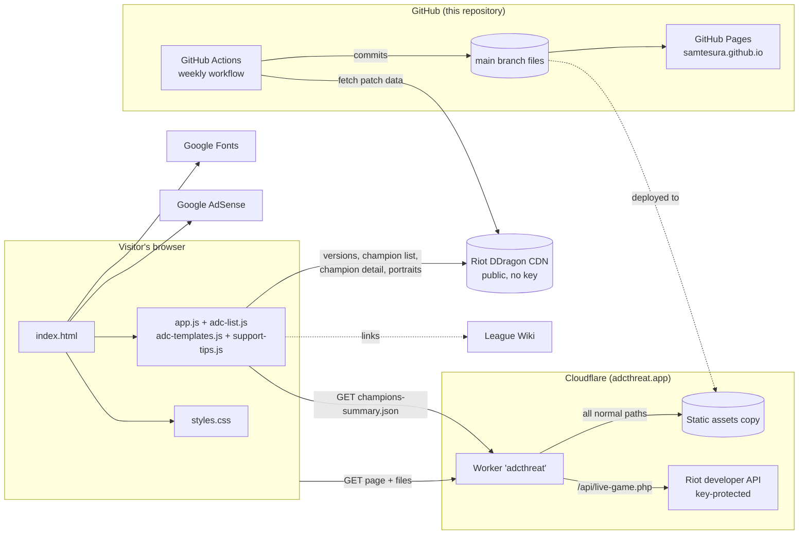
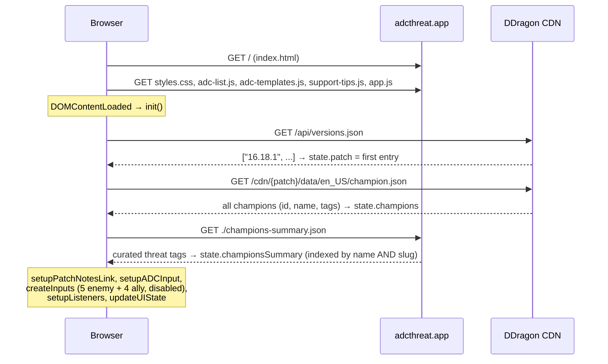
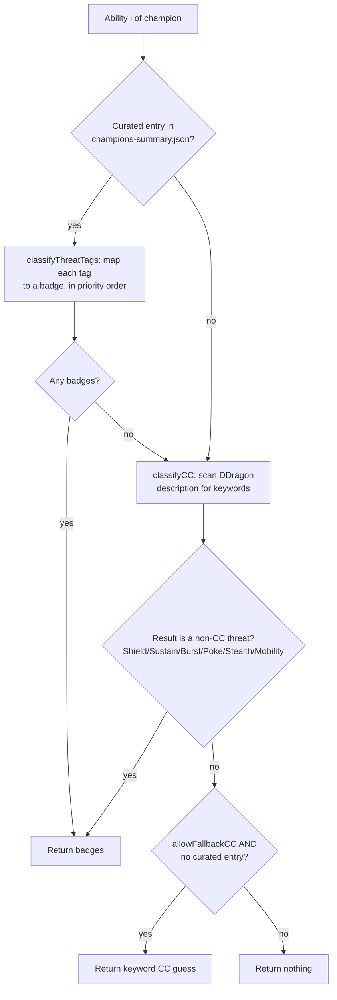

# ADC Threat — Technical Reference & Operations Manual

> **Purpose.** A single document describing how every part of [adcthreat.app](https://adcthreat.app) is built, how the pieces talk to each other, what the algorithms do, and what to check first when something breaks. It is written so that a non-developer can follow it, and so that a developer can make a change without having to re-read the whole codebase first.
>
> **Last audited:** September 2026 (repository state at champion-data patch `26-18`).
> **Keep this file current.** Any time a file is added, renamed, or its role changes, update [§4 File map](#4-file-map) and the relevant section.

---

## Table of contents

1. [Glossary (read this first)](#1-glossary-read-this-first)
2. [What the site does, in one paragraph](#2-what-the-site-does-in-one-paragraph)
3. [System architecture](#3-system-architecture)
4. [File map](#4-file-map)
5. [Page load sequence](#5-page-load-sequence)
6. [Application state & user interaction flow](#6-application-state--user-interaction-flow)
7. [Algorithms](#7-algorithms)
8. [Data files & their schemas](#8-data-files--their-schemas)
9. [Automated data pipeline (GitHub Actions)](#9-automated-data-pipeline-github-actions)
10. [Hosting, domain & deployment](#10-hosting-domain--deployment)
11. [Styling system](#11-styling-system)
12. [SEO, social previews, ads & PWA metadata](#12-seo-social-previews-ads--pwa-metadata)
13. [External dependencies](#13-external-dependencies)
14. [How-to recipes (common changes)](#14-how-to-recipes-common-changes)
15. [Troubleshooting runbook](#15-troubleshooting-runbook)
16. [Known issues & technical debt](#16-known-issues--technical-debt)
17. [Scaling guidance](#17-scaling-guidance)

---

## 1. Glossary (read this first)

Terms are listed in the order you are most likely to meet them.

| Term | Plain-language meaning |
|---|---|
| **Static site** | A website made only of files (HTML, CSS, JavaScript, images, JSON) that are sent to the browser as-is. There is no program on a server building pages for each visitor. |
| **HTML** | The skeleton of a page: headings, inputs, tables. File: `index.html`. |
| **CSS** | The styling rules: colours, spacing, fonts, layout. File: `styles.css`. |
| **JavaScript (JS)** | The code that runs *inside the visitor's browser* and makes the page interactive. Files: `app.js`, `adc-list.js`, etc. |
| **Vanilla JS** | JavaScript written without a framework (no React, Vue, etc.). What you see in the file is exactly what runs. There is **no build step** — no compiling or bundling before publishing. |
| **DOM** | *Document Object Model.* The browser's live, in-memory version of the HTML page. JavaScript changes what the user sees by editing the DOM (e.g. adding a table row). |
| **JSON** | *JavaScript Object Notation.* A plain-text format for structured data (`{"name": "Ahri"}`). `champions-summary.json` is JSON. |
| **API** | *Application Programming Interface.* A URL that returns data for programs instead of a page for humans. |
| **Riot Data Dragon (DDragon)** | Riot Games' free, public, no-key-required CDN that hosts League of Legends game data (champion list, ability descriptions, cooldowns, images) for every patch. The site's main live data source. |
| **CDN** | *Content Delivery Network.* A network of servers around the world that deliver files quickly from a location near the visitor. |
| **Patch / patch version** | League's game update. DDragon names them like `16.18.1`; Riot's public patch notes call the same patch `26.18` (see [§7.5](#75-patch-number-conversion)). |
| **Riot Games API (developer API)** | A *different*, key-protected Riot service with player/match data. Only used by the Cloudflare Worker's optional live-game endpoint (see [§10.2](#102-the-cloudflare-worker)). Not used by the current front-end. |
| **CC (Crowd Control)** | Any game effect that limits a champion's actions: stun, root, slow, knock-up, etc. |
| **Cleanse / QSS** | *Cleanse* is a summoner spell; *QSS (Quicksilver Sash)* is an item. Both remove certain CC. Suppression can only be removed by QSS. Knock-ups/pulls (forced movement) and Nearsight cannot be fully removed. |
| **Threat tag** | A label such as `STUN` or `GAP_CLOSE` that a human attached to a champion's ability in `champions-summary.json`. The site turns these into coloured badges. |
| **GitHub Actions** | GitHub's built-in automation service. It runs scripts on GitHub's machines on a schedule or on demand. Used here to refresh champion data weekly. |
| **Workflow** | A GitHub Actions recipe file (YAML) in `.github/workflows/`. |
| **Cron expression** | A compact way to write a schedule, e.g. `0 13 * * 3` = "13:00 UTC every Wednesday". |
| **UTC** | Coordinated Universal Time — the time zone GitHub uses for schedules. New York is UTC−5 in winter, UTC−4 in summer. |
| **Node.js** | A program that runs JavaScript *outside* a browser. Used only by the update script, never by visitors. |
| **npm / `package.json`** | Node's package manager and its config file. Lists the scripts you can run (`npm run update-data`). |
| **Cloudflare** | Company providing DNS, CDN, and serverless hosting. `adcthreat.app` is served through Cloudflare. |
| **Cloudflare Worker** | A small program that runs on Cloudflare's servers for every request to the domain. Here it serves the static files and exposes one optional API route. |
| **Static Assets binding (`env.ASSETS`)** | The Worker feature that holds a copy of the site's files and serves them. |
| **DNS** | The internet's phone book: maps `adcthreat.app` to the servers that answer it. |
| **Canonical URL** | A tag telling search engines which address is the "official" copy of a page. |
| **Open Graph (OG) / Twitter Card** | Meta tags that control the title/image/description shown when a link is pasted into Discord, X/Twitter, Facebook, etc. |
| **JSON-LD / Schema.org** | Structured data inside a `<script type="application/ld+json">` block that helps Google understand what the page is. |
| **PWA / Web App Manifest** | *Progressive Web App.* A site that can be "installed" like an app. Requires a manifest file (`site.webmanifest`) linked from the HTML and, for offline use, a *service worker*. See [§12](#12-seo-social-previews-ads--pwa-metadata) — this site currently does **not** meet those requirements. |
| **AdSense / `ads.txt`** | Google's ad network. `ads.txt` is a public file declaring which ad sellers are authorised to sell ads on the domain. |
| **CORS** | *Cross-Origin Resource Sharing.* Browser security rule controlling which websites may call an API. |
| **CSRF token** | A short-lived signed value proving a request came from the real site, protecting an API from forged requests. |
| **Rate limiting** | Capping how many requests one visitor can make per time window. |
| **Autocomplete** | The drop-down of suggested champion names while typing. |
| **Normalisation (search)** | Converting text to a comparable form (lower-case, no spaces/apostrophes) so `kaisa` matches `Kai'Sa`. |
| **Heuristic** | A rule of thumb — e.g. "if a description contains the word *stun*, treat it as a stun". Fast but not always right. |
| **Regex (regular expression)** | A text-pattern language used for find/replace in code. |

---

## 2. What the site does, in one paragraph

A player chooses the ADC (bot-lane marksman) they are playing, then types up to **5 enemy** and **4 allied** champion names. For each champion the site builds a table row showing: team, portrait (linked to the League Wiki), each ability's **name and cooldowns per rank**, **colour-coded threat badges** (hard CC, cleansable CC, QSS-only, mobility, shields, …) and a short **generated advice paragraph**. Champion names, cooldowns and descriptions are fetched live from Riot's DDragon for the current patch; the threat tags are a hand-curated file stored in this repository and refreshed weekly by an automated job.

---

## 3. System architecture



**Key idea:** there is no database and no server-side page generation. Everything the visitor sees is assembled in their browser from (a) files in this repo and (b) live DDragon data.

Two public addresses serve the same files:

| Address | Served by | Notes |
|---|---|---|
| `https://adcthreat.app` | Cloudflare Worker `adcthreat` (static assets) | The primary, advertised address. |
| `https://samtesura.github.io` | GitHub Pages, straight from `main` | Still live. The page's canonical/OG tags still point here (see [§16](#16-known-issues--technical-debt)). |

---

## 4. File map

| Path | Kind | Loaded by visitors? | Role |
|---|---|---|---|
| `index.html` | HTML | ✅ | Page skeleton, meta/SEO tags, AdSense script, font import, loads the 4 JS files **in order**. |
| `styles.css` | CSS | ✅ | Entire visual design: colour tokens, layout, table, badges, responsive breakpoints. |
| `adc-list.js` | JS (data) | ✅ | `ADC_LIST` (which champions can be picked as "Your ADC", split marksman/mage, plus helper methods and a tier list) and `SUPPORT_TYPES`. |
| `adc-templates.js` | JS (data) | ✅ (loaded, **not used**) | `ADC_TEMPLATES`: hand-written matchup tips + macro advice for 29 ADCs. See [§16](#16-known-issues--technical-debt). |
| `support-tips.js` | JS (data) | ✅ (loaded, **not used**) | `SUPPORT_TEMPLATES`: hand-written support-synergy tips for 21 supports. |
| `app.js` | JS (logic) | ✅ | All application logic: fetching data, autocomplete, state, threat classification, table rendering. |
| `champions-summary.json` | JSON (data) | ✅ (fetched at runtime) | Curated threat tags + cooldowns for all 173 champions. Updated by the weekly workflow. |
| `assets/favicon.ico` | Image | ✅ | Favicon actually referenced by `index.html`. |
| `icons/*` | Images | ❌ (only via manifest) | Favicons/app icons in several sizes, referenced by `site.webmanifest`. |
| `og/adc-threat-hero.png` | Image | Social crawlers | Link-preview image (1200×630). |
| `og/adc-threat-hero.png.png` | Image | ❌ | Accidental duplicate (1.3 MB). Safe to delete. |
| `site.webmanifest` | JSON | ❌ (not linked) | PWA manifest. Not linked from `index.html`; `start_url` is wrong. |
| `ads.txt` | Text | Ad crawlers | Declares the Google AdSense publisher ID as authorised seller. Must stay at the domain root. |
| `scripts/update-champion-data.js` | Node.js | ❌ | The weekly data-refresh script. |
| `.github/workflows/update-champion-data.yml` | YAML | ❌ | Schedules and runs the script, commits changes. |
| `package.json` | JSON | ❌ | npm scripts (`update-data`, `test-update`). Declares `axios`, which the script does not actually use. |
| `README.md` | Docs | ❌ | Public project overview. |
| `docs/TECHNICAL_REFERENCE.md` | Docs | ❌ | This file. |
| `AUTO_UPDATE.md` | Docs | ❌ | Older description of the update pipeline. |
| `CONTRIBUTING.md`, `SECURITY.md`, `LICENSE` | Docs | ❌ | Contribution guide, security policy, MIT licence. |
| `.gitignore` | Config | ❌ | Files git must ignore (`node_modules/`, `ftp-upload/`, editor files…). |

**Script load order matters.** `index.html` loads `adc-list.js` → `adc-templates.js` → `support-tips.js` → `app.js`. The first three define global constants (`ADC_LIST`, `ADC_TEMPLATES`, `SUPPORT_TEMPLATES`) that `app.js` expects to already exist. If you reorder them, or a data file has a syntax error (e.g. a missing comma), **the whole site stops working**.

---

## 5. Page load sequence



`init()` in `app.js` runs these steps **sequentially**. If step 1 or 2 fails (DDragon down, no internet), the user gets a browser `alert("Failed to load champion data. Please refresh.")`. If only `champions-summary.json` fails, the app continues without curated tags and falls back to text heuristics ([§7.3](#73-threat-classification)).

On start-up, `init()` also deletes two obsolete `localStorage` keys (`riot_api_key`, `cors_proxy`) left behind by a removed live-game feature. Nothing else is stored in the browser.

---

## 6. Application state & user interaction flow

All runtime data lives in one object in `app.js`:

```js
state = {
  patch,             // "16.18.1" — current DDragon version
  champions,         // { "Ahri": {id, name, tags, ...}, ... } from DDragon
  championsSummary,  // { "Ahri": {...}, "MonkeyKing": {...}, "Wukong": {...} } curated data
  selectedADC,       // the DDragon champion object the user picked, or null
  enemies,           // array, index 0-4 → champion object or undefined
  allies             // array, index 0-3 → champion object or undefined
}
```

Nothing is saved between visits — a refresh starts from zero.

**Flow:**

1. **Pick your ADC.** Focusing/typing in *Your ADC* shows every champion from `ADC_LIST.getAllADCs()` that matches ([§7.1](#71-champion-search--autocomplete)). Clicking one calls `selectADC()`: it shows the portrait + Wiki link, hides the yellow warning banner, and **enables** the 9 team inputs (`updateUIState()`).
2. **Add enemies/allies.** Each input searches **all** champions (top 5 results). Selecting one stores it in `state.enemies[i]` / `state.allies[i]` and calls `updateTable()`. A "×" button appears to remove it; emptying the input also removes it.
3. **Table render.** `updateTable()` clears the table and creates one row per chosen champion (enemies first). Each row immediately shows team + portrait, then fetches that champion's detail file from DDragon and fills *Key Abilities*, *Threats* and *Challenger Tips* when it arrives (`Loading...` until then).
4. **Clear All** resets `state`, empties and disables inputs, and re-renders the empty table.

Autocomplete uses the `mousedown` event (not `click`) and closes the dropdown 300 ms after the input loses focus, so the click on a suggestion is registered before the list disappears.

---

## 7. Algorithms

### 7.1 Champion search & autocomplete

Functions: `normalizeForSearch`, `handleADCInput`, `handleInput` in `app.js`.

1. **Normalise** the query and every champion name: lower-case, then remove apostrophes, spaces, hyphens and dots. So `"Kai'Sa"` → `kaisa`, `"Dr. Mundo"` → `drmundo`.
2. **Filter**: keep a champion if its normalised name *contains* the normalised query (or the raw lower-case name contains the raw query).
3. **Sort**: champions whose name *starts with* the query come first; ties are alphabetical.
4. **Limit**: ADC box shows all matches (empty query shows the full ADC list alphabetically); team boxes show the top **5**.

Complexity is linear in the number of champions (~170), which is instantaneous.

### 7.2 Which champions count as an "ADC"

`ADC_LIST` in `adc-list.js` holds two hand-maintained arrays of **DDragon IDs** (not display names): `marksman` (26) and `mage` (11). `getAllADCs()` concatenates them. An ID that does not exist in DDragon's champion list is silently skipped, so a typo simply makes that champion unpickable.

> ⚠️ IDs differ from display names: `Kaisa` not `Kai'Sa`, `KogMaw` not `Kog'Maw`, `MissFortune` not `Miss Fortune`, `AurelionSol` not `Aurelion Sol`, `MonkeyKing` for Wukong. Check the ID at `https://ddragon.leagueoflegends.com/cdn/<patch>/data/en_US/champion.json`.

`getADCRole()`, `isADC()`, `getMetaTier()` and `SUPPORT_TYPES` exist but are **not called** anywhere in the app today.

### 7.3 Threat classification

This is the core logic. Every ability (Q, W, E, R) of every champion in the table goes through `classifyAbility(spell, summaryData, abilityIndex, allowFallbackCC)`:



**Step A — curated tags (`classifyThreatTags`).** Each tag string maps to `{type, ccType, cleansable, qssOnly, color}`. Tags are emitted in a fixed **priority order** (most dangerous first), and the *first* one decides the colour of the cooldown badge:

| Priority group | Tags | Badge colour | Cleanse? |
|---|---|---|---|
| QSS-only | `SUPPRESSION` | red (hard) | 🔒 QSS only |
| Not cleansable | `NEARSIGHT`, `KNOCKUP`, `KNOCKBACK`, `PULL` | red (hard) | ✗ |
| Disabling CC | `STUN`, `ROOT`, `SNARE`, `CHARM`, `FEAR`, `TAUNT`, `SLEEP`, `POLYMORPH` | red (hard) | ✓ |
| Impairing CC | `SILENCE`, `BLIND`, `DISARM`, `GROUNDED`, `CRIPPLE`, `SLOW` | blue (soft) | ✓ |
| High threat (non-CC) | `DODGE`, `PROJECTILE_BLOCK`, `UNBREAKABLE_WALL`, `STEALTH`, `GAP_CLOSE`, `DASH`, `BURST` | orange (high) | — |
| Medium | `BREAKABLE_WALL`, `REVEAL`, `SHIELD_PEEL`, `SHIELD` | medium | — |
| Low | `SUSTAIN`, `GHOST` | low | — |

Any tag **not** in this table (e.g. `SUSPENSION`, used once in the data) is silently ignored. `BURST` is mapped but missing from the priority list, so it is also ignored in practice.

**Step B — keyword fallback (`classifyCC`).** Lower-cases the ability's DDragon description and returns the **first** match, checked in this order: `suppress` → `knock`/`airborne` → `pull`/`drag` → `nearsight` → `stun` → `root`/`immobilize`/`snare` → `slow` → `charm` → `fear`/`flee` → `taunt` → `silence` → `blind` → `disarm` → `cripple`/"attack speed…reduc" → `sleep`/`drowsy` → `dash`/`blink`/`leap` (Mobility) → `burst`/"damage+bonus"/"maximum health"/"missing health" (Burst) → `stealth`/`invisible`/`camouflage` → `shield` → `poke` → `heal`/`regenerat` (Sustain). This is a heuristic: it can mislabel an ability that merely *mentions* a word.

**Where each mode is used:**

| Column | Call | Effect |
|---|---|---|
| *Key Abilities* | `allowFallbackCC = false` | Curated tags; keyword guess only for non-CC threats. |
| *Threats* (enemies) | `allowFallbackCC = true` via `analyzeThreats` | Curated tags; if a champion has no curated entry at all, keyword CC guesses are allowed. Duplicates removed; max **10** badges. |
| *Threats* (allies) | — | Shows DDragon role tags (`Mage`, `Support`…) instead of threats. |

Severity mapping for the Threats column: `hard`/`suppression` → high, `soft` → medium, anything else keeps its own level.

### 7.4 "Challenger Tips" text generation

Despite the column name, tips are **generated**, not taken from `adc-templates.js` / `support-tips.js`:

* **Enemy** (`generateEnemyUnderstanding`): runs `classifyCC` on each ability (keyword heuristic only, ignores curated tags) and builds: "*X threat analysis: Watch for CC (Stun, Slow). High mobility – respect gap closers… Burst damage threat… Track cooldowns… Visit wikilol…*".
* **Ally** (`generateAllyUnderstanding`): picks a template by the champion's first matching DDragon role (`Support` → `Tank` → `Mage` → `Fighter` → `Assassin` → generic), then adds sentences depending on whether its descriptions mention CC, dash/blink/leap, heal, shield or poke.

The selected ADC is only checked for existence — **the text does not change based on which ADC you picked.**

### 7.5 Patch number conversion

DDragon version `16.18.1` ↔ patch notes `26.18`. Since 2025 Riot numbers patches by year (2025 → 25.x) while DDragon kept its old counter (15.x in 2025). Rule used in both `app.js` (`setupPatchNotesLink`) and the update script: **if major ≥ 15, add 10**, then keep only `major-minor`. The link becomes `https://www.leagueoflegends.com/en-us/news/game-updates/league-of-legends-patch-26-18-notes/`.

If Riot ever changes the numbering scheme again, update **both** places.

### 7.6 Cooldown display

Cooldowns come live from DDragon (`spell.cooldown`, one value per rank) and are joined with `/` (e.g. `14/12/10/8/6s`). The badge suffix shows cleanse status of the ability's top-priority tag: `🔒` QSS-only, `✓` cleansable, `✗` not fully cleansable (Airborne/Pull/Nearsight in keyword mode). Hovering a badge shows an explanation tooltip.

---

## 8. Data files & their schemas

### 8.1 `champions-summary.json`

```jsonc
{
  "patchVersion": "26-18",          // written by the update script
  "champions": [                     // sorted alphabetically by name
    {
      "name": "Aatrox",              // display name — primary lookup key
      "slug": "Aatrox",              // DDragon ID — secondary lookup key
      "tags": ["FIGHTER"],           // role tags (informational)
      "portrait": "Aatrox",          // DDragon ID used for images (informational)
      "passive": { "name": "Deathbringer Stance", "desc": "" },
      "abilities": [                 // ALWAYS 4, in order Q, W, E, R
        {
          "key": "Q",
          "name": "The Darkin Blade",
          "cd": [14, 12, 10, 8, 6, 6],   // padded to 6 values by the script
          "threat": ["KNOCKUP"],         // curated tags — see §7.3 table
          "notes": ""                    // free text; not displayed
        }
      ]
    }
  ]
}
```

* **What the site actually uses from this file:** only `name`/`slug` (lookup) and `abilities[i].threat`. Cooldowns and ability names shown on the page come from DDragon live, *not* from this file.
* **Automatically maintained:** `patchVersion`, `cd`, ability `name`, `passive.name`, new champion entries.
* **Human-maintained:** `threat` arrays, `notes`, `tags`.
* New champions are added with empty `threat` arrays and the note `"⚠️ New champion - threat tags need manual review"`. Search the file for that text to find champions awaiting tags (currently: **Locke**).

### 8.2 `adc-list.js`
See [§7.2](#72-which-champions-count-as-an-adc). Uses DDragon **IDs**.

### 8.3 `adc-templates.js` (`ADC_TEMPLATES`)
Keyed by **display name** (`"Kai'Sa"`, `"Miss Fortune"`). Each entry: `tips: { "<opponent display name>": "<text>" }` and `macro: { tempo_advantage, wave_management, key_timer }`. Currently not rendered.

### 8.4 `support-tips.js` (`SUPPORT_TEMPLATES`)
Keyed by support display name. Each entry: `synergy: { "<ADC display name>": "<text>" }`. Currently not rendered.

---

## 9. Automated data pipeline (GitHub Actions)

**File:** `.github/workflows/update-champion-data.yml` → runs `scripts/update-champion-data.js`.

**When it runs**

| Trigger | Schedule (UTC) | = New York time |
|---|---|---|
| Cron, Nov–Mar, Wednesdays | `0 13 * 11,12,1,2,3 3` | 08:00 EST |
| Cron, Apr–Oct, Wednesdays | `0 12 * 4,5,6,7,8,9,10 3` | 08:00 EDT |
| Manual | *Actions → Auto-Update Champion Data → Run workflow* (option `force_update`) | any time |

The month split approximates daylight-saving time; in the weeks around the March/November clock change it can run an hour off. GitHub may also delay scheduled runs by several minutes under load, and in public repositories it **disables scheduled workflows after 60 days without repository activity** — check the *Actions* tab if data stops updating.

**What the script does, step by step**

1. Download `versions.json` from DDragon; take the first (newest) version, e.g. `16.18.1`; convert to `26-18` ([§7.5](#75-patch-number-conversion)).
2. Read `app.js` looking for `const latestUpdate = "…"` to compare with the current patch. (That line no longer exists — see [§16](#16-known-issues--technical-debt) — so this check never short-circuits and the script always proceeds.)
3. Download DDragon `champion.json` (list of all champions).
4. Load the existing `champions-summary.json`, index it by display name.
5. For **each** champion, download its detail file (`champion/<Id>.json`), pausing 100 ms after every 10 requests.
   * **Existing champion:** replace each ability's `cd` (padded to 6 values by repeating the last one) and `name`, and the passive name, if they changed. **Threat tags and notes are never touched.**
   * **New champion:** create an entry with DDragon role tags, cooldowns, ability names, empty threat arrays and a review note.
   * **Fetch error:** keep the old entry unchanged.
   * A champion present locally but removed from DDragon is dropped.
6. Sort alphabetically; write `{ patchVersion, champions }` with 2-space indentation.
7. Attempt to rewrite `const latestUpdate` in `app.js` (no-op today).
8. The workflow runs `git diff`. If anything changed, it commits `champions-summary.json` and `app.js` as `github-actions[bot]` and pushes to `main`.

A push to `main` automatically refreshes GitHub Pages. Whether it also refreshes adcthreat.app depends on how the Cloudflare Worker is deployed ([§10.2](#102-the-cloudflare-worker)).

**Running it yourself**

```bash
npm run update-data     # normal run (Node 20+; no npm install required — uses built-in https)
npm run test-update     # FORCE_UPDATE=true (macOS/Linux shell syntax)
```

Then review `git diff champions-summary.json` before committing.

---

## 10. Hosting, domain & deployment

### 10.1 Overview

| Piece | Where it is configured |
|---|---|
| Domain `adcthreat.app` DNS | Cloudflare dashboard (the domain resolves to Cloudflare addresses). |
| Serving `adcthreat.app` | Cloudflare Worker named **`adcthreat`** (created June 2026). |
| Serving `samtesura.github.io` | GitHub → repository *Settings → Pages*, from `main`. There is **no `CNAME` file** in the repo, so GitHub Pages is not what serves the custom domain. |
| Weekly data updates | GitHub Actions (this repo). |
| Ads | Google AdSense account + `ads.txt`. |

### 10.2 The Cloudflare Worker

The Worker's source code is **not stored in this repository** (it lives in Cloudflare / wherever it was deployed from). Its behaviour, as deployed:

* **Every path except one** → `env.ASSETS.fetch(request)`, i.e. returns the matching static file (`/`, `/app.js`, `/champions-summary.json`, …).
* **`/api/live-game.php`** → a small API proxy to the key-protected Riot developer API, left over from a "load champions from my live game" feature. The current front-end **does not call it**. Actions (query string `?action=`):
  * `csrf` – issues a signed token valid 1 hour.
  * `summoner` (POST, needs token) – Riot ID → PUUID via `account-v1`.
  * `live-game` (POST, needs token) – current game via `spectator-v5`, split into allies/enemies with a role guess from summoner spells (Smite → jungle, Heal+Flash → ADC, Exhaust → support, Teleport → top, Ignite+Flash / Ghost → mid).
  * `test` – reports whether the Riot key is configured and working.
  * Protections: CORS allow-list (`adcthreat.app`, `www.adcthreat.app`, localhost), per-IP rate limit of 30 requests / 60 s (only if a KV namespace is bound as `RATE_LIMIT`), region allow-list, input length checks.
  * Expects Worker secrets/bindings: `RIOT_API_KEY`, `CSRF_SECRET` (recommended; set it), `RATE_LIMIT` (KV, optional), `ASSETS`.

> **To confirm how assets reach the Worker** (Git-connected build vs. manual `wrangler deploy`/upload): Cloudflare dashboard → *Workers & Pages → adcthreat → Settings → Build* and *Deployments*. Record the answer here. If it is **not** connected to this repo, the weekly data commits will **not** reach adcthreat.app until someone redeploys.

### 10.3 How to deploy a change

1. Edit files, test locally ([§14.1](#141-run-the-site-locally)).
2. Commit and push to `main` (or open a pull request and merge it).
3. GitHub Pages updates within ~1–2 minutes (`samtesura.github.io`).
4. adcthreat.app updates via the Worker deployment path in §10.2.
5. Hard-refresh the browser (Ctrl/Cmd+Shift+R) — browsers and Cloudflare may cache old files.

### 10.4 Rolling back

Every change is a git commit. To undo the last one on `main`: `git revert <commit>` then push. For data-only issues, restore a previous version of `champions-summary.json` with `git checkout <good-commit> -- champions-summary.json`, commit, push.

---

## 11. Styling system

`styles.css` (~950 lines), dark "Hextech" theme, **no framework**.

* **Design tokens** in `:root` — change a colour/spacing once and it applies everywhere:
  * Backgrounds `--color-bg-primary #01050d`, `--color-bg-secondary`, `--color-bg-tertiary`
  * Accent gold `--color-accent-gold #c89b3c`, red `#cf262f`, green `#0aaf6d`, blue `#5b9acd`, purple `#884ea0`
  * Spacing `--spacing-xs` (4 px) … `--spacing-2xl` (20 px); font sizes `--font-size-xs` (11 px) … `--font-size-3xl` (28 px)
  * `--touch-target-min: 36px`, radii, transition speeds, z-index layers
* **Font:** Inter (400/500/600/700) from Google Fonts, with system-font fallback.
* **Class prefixes:** `qr-*` layout blocks (header, input panel, teams, table wrap); `cd-*` cooldown badge colours (`cd-hard`, `cd-soft`, `cd-high`, `cd-medium`, `cd-low`); `threat-*` threat badges; `tag-*` role tags; `team-*` enemy/ally pills; `autocomplete*` dropdown.
* **Breakpoints:** ≥1920 px, ≤1600, ≤1200, ≤768 (tablet), ≤480 (phone). Also `prefers-reduced-motion`, high-DPI, and `@media print` rules.
* Some styles are set inline from `app.js` (autocomplete wrappers, selected-ADC link). Search `app.js` for `.style.` if a style change "doesn't work" from CSS.

---

## 12. SEO, social previews, ads & PWA metadata

All in the `<head>` of `index.html`:

| Block | Purpose | Status |
|---|---|---|
| `<title>`, description, keywords | Search result text | OK |
| `rel="canonical"` | Official URL | Points to `samtesura.github.io`, should be `adcthreat.app` |
| Open Graph / Twitter tags | Link previews | URLs point to `samtesura.github.io` |
| JSON-LD `WebApplication` | Google structured data | Contains a hard-coded `aggregateRating` (4.8 / 250) that is not backed by real reviews — Google's policies prohibit this and it can trigger a manual action. Remove it. |
| AdSense script + `google-adsense-account` meta | Ads | Publisher ID must match `ads.txt` |
| Favicon | Tab icon | Uses `assets/favicon.ico` declared as `image/png` |
| Web App Manifest | Installable PWA | `site.webmanifest` exists but is **not linked**, its `start_url` (`/ADC-Threat/`) is wrong, and there is no service worker, so the site is **not** installable/offline-capable today. |

---

## 13. External dependencies

| Service | Used for | If it is down |
|---|---|---|
| Riot DDragon (`ddragon.leagueoflegends.com`) | Patch version, champion list, champion details, portraits (browser **and** workflow) | Site shows "Failed to load champion data"; weekly job fails (no harm, next week retries). |
| Google Fonts | Inter font | Falls back to system font; no functional impact. |
| Google AdSense | Ads | Empty ad slots; no functional impact. |
| League Wiki (`wiki.leagueoflegends.com`) | Outbound links only | Links break; no functional impact. |
| Riot patch-notes site | Outbound link only | Link 404s if Riot changes URL format. |
| GitHub Actions / Pages | Automation, mirror hosting | Data stops auto-updating / mirror unavailable. |
| Cloudflare | Primary hosting | adcthreat.app unavailable (mirror still up). |

Runtime npm dependencies: **none**. `package.json` lists `axios` but no code imports it.

---

## 14. How-to recipes (common changes)

### 14.1 Run the site locally
The site must be served over HTTP (not opened as a `file://`) because `app.js` uses `fetch('./champions-summary.json')`.
```bash
git clone https://github.com/SamTesura/samtesura.github.io.git
cd samtesura.github.io
npx serve .            # or: python3 -m http.server 8123
# open the printed http://localhost:... address
```

### 14.2 Add or remove a pickable ADC
Edit the `marksman` or `mage` array in `adc-list.js` using the **DDragon ID**. Save, reload, type the name in *Your ADC*.

### 14.3 Fix or add threat tags for a champion
1. Open `champions-summary.json`, find the champion by `"name"`.
2. Edit the `threat` array of the correct ability (order is Q, W, E, R). Use only tags from the [§7.3 table](#73-threat-classification); anything else is ignored.
3. Validate the JSON (e.g. paste into [jsonlint.com](https://jsonlint.com) or run `node -e "JSON.parse(require('fs').readFileSync('champions-summary.json'))"`). One missing comma breaks the whole file.
4. Remove the "New champion" note if present.

### 14.4 Add a new threat tag type
In `app.js` → `classifyThreatTags`: add an entry to `ccClassifications` **and** insert the tag in `priorityOrder`. Add an emoji in `getThreatIcon`. Optionally add CSS for a new colour.

### 14.5 A new champion was released
The weekly job adds it automatically with empty tags. Fill in its tags (§14.3). If it's an ADC, also add it to `adc-list.js` (§14.2).

### 14.6 Force a data refresh now
GitHub → *Actions* → *Auto-Update Champion Data* → *Run workflow* → set `force_update` to `true`.

### 14.7 Change the update schedule
Edit the `cron:` lines in the workflow. Use [crontab.guru](https://crontab.guru) and remember the schedule is **UTC**.

### 14.8 Change colours / fonts
Edit tokens in `:root` of `styles.css` (§11). For the font, change the Google Fonts `<link>` in `index.html` and `font-family` on `body`.

### 14.9 Change the domain in SEO tags
Replace `https://samtesura.github.io/` in `index.html` (canonical, `og:url`, `og:image`, `twitter:url`, `twitter:image`, JSON-LD `url`).

---

## 15. Troubleshooting runbook

Always start by opening the site, pressing **F12** (Developer Tools) and checking the **Console** (red errors) and **Network** (failed requests, red rows) tabs.

| Symptom | Likely cause | Where to look / fix |
|---|---|---|
| Pop-up "Failed to load champion data" | DDragon unreachable, or a JS error during start-up | Network tab: `versions.json` / `champion.json` failing? Try the URLs directly. If DDragon is fine, check Console for a syntax error in a `.js` file edited recently. |
| Page loads but nothing is interactive, Console shows `ReferenceError: ADC_LIST is not defined` (or `ADC_TEMPLATES`) | Syntax error in a data file, or wrong `<script>` order | Revert the last edit to `adc-list.js` / `adc-templates.js` / `support-tips.js`; check script order in `index.html`. |
| An ADC is missing from the *Your ADC* list | Not in `ADC_LIST`, or ID typo (display name used instead of ID) | §7.2, §14.2. |
| Threat badges missing/wrong for one champion | Tag missing/misspelled in `champions-summary.json`, or name mismatch with DDragon | §14.3. Lookup is by exact display name, then by DDragon ID. |
| All rows show only keyword-guessed threats | `champions-summary.json` failed to load or is invalid JSON | Network tab for that file; validate JSON; `git log -p champions-summary.json` for the last change. |
| Rows stuck on "Loading..." | That champion's DDragon detail request failed (no error handling) | Network tab → `champion/<Id>.json`. Usually transient. |
| Patch-notes link gives 404 | Riot changed URL scheme or numbering | §7.5 — update `setupPatchNotesLink` and the script. |
| Portraits broken | DDragon image path changed / version mismatch | Check `CONFIG.CHAMPION_IMG` in `app.js`. |
| Weekly workflow failed (red ✗ in Actions) | DDragon error, JSON parse error, or push rejected | Open the run log. Re-run once; if it still fails, run `npm run update-data` locally to reproduce. |
| Workflow stopped running entirely | GitHub auto-disabled the schedule after 60 days of inactivity | *Actions* tab → enable the workflow. |
| adcthreat.app shows an old version but samtesura.github.io is current | Worker not redeployed / cache | §10.2 — check Worker deployments; purge Cloudflare cache. |
| adcthreat.app completely down | Cloudflare/Worker/DNS issue | Cloudflare dashboard → Worker status & DNS; point people to `samtesura.github.io` meanwhile. |
| Ads not showing | AdSense approval/policy, ad blocker, or `ads.txt` mismatch | AdSense dashboard; ensure `https://adcthreat.app/ads.txt` is served. |
| Link previews show old image/text | Social platforms cache OG data | Update tags (§14.9); re-scrape with the platform's debug tool. |

---

## 16. Known issues & technical debt

Documented, **not yet fixed**. Ordered roughly by impact.

1. **Curated tip files are not displayed.** `adc-templates.js` (29 ADCs) and `support-tips.js` (21 supports) are downloaded by every visitor (~105 KB) but `app.js` never reads them. The "Challenger Tips" column is generic generated text that ignores your selected ADC. Note: those files key by display name (`"Kai'Sa"`) while `ADC_LIST` uses IDs (`Kaisa`), so wiring them up needs a name/ID mapping.
2. **Update script's patch check is broken.** It looks for `const latestUpdate = "…"` in `app.js`, which no longer exists. Consequences: the script always does a full refresh (harmless), `app.js` is never updated, and every bot commit message reads "Auto-update champion data for patch " with a blank patch. Fix: compare against `patchVersion` in `champions-summary.json` instead, and use it in the workflow commit message.
3. **Canonical/OG/Twitter/JSON-LD URLs point to `samtesura.github.io`** rather than `adcthreat.app`, splitting search-engine ranking between two addresses.
4. **Fabricated `aggregateRating`** in JSON-LD (see §12).
5. **PWA not functional**: manifest unlinked, wrong `start_url`, no service worker.
6. **No caching of champion detail requests.** Every table re-render re-downloads each champion's DDragon file; failures leave "Loading..." with no retry.
7. **Unknown tags silently ignored** (`SUSPENSION`, and `BURST` missing from the priority list).
8. **Enemy tips use keyword heuristics only**, so they can disagree with the curated badges in the same row.
9. **Documentation drift:** `SECURITY.md` and `AUTO_UPDATE.md` still describe a GitHub-Pages-only site with no backend; the Cloudflare Worker and its API route are not mentioned there. `package.json` lists an unused `axios`.
10. **Worker source not version-controlled here**, and the live-game API route is live but unused by the front-end (unnecessary attack surface / Riot key exposure risk). Either commit its source (without secrets) or remove the route.
11. **Housekeeping:** duplicate `og/adc-threat-hero.png.png` (1.3 MB); `assets/favicon.ico` duplicates `icons/favicon.ico`; `THREAT_LABELS`, `CC_TYPES`, `ADC_LIST.getMetaTier`, `SUPPORT_TYPES` unused; tier list comment references patch 25.22.

---

## 17. Scaling guidance

If the site grows (more pages, more data, more contributors), in this order:

1. **Keep this document current**; add a section per new feature.
2. **Split `app.js`** into modules by concern (`data.js` fetching, `search.js`, `classify.js`, `render.js`) using `<script type="module">` — still no build step required.
3. **Add a JSON check to CI** (a GitHub Action that runs `node -e "JSON.parse(...)"` and a syntax check on every push) so a bad edit can't reach production.
4. **Cache DDragon responses** in memory (and optionally `localStorage` keyed by patch) to cut requests.
5. **Move curated data to JSON** (`adc-templates.js`, `support-tips.js` → `.json`) so non-developers can edit data without touching code, and validate with a JSON Schema.
6. **Put the Worker source in this repo** (e.g. `worker/` with `wrangler.toml`, secrets excluded) and deploy it from GitHub so hosting is reproducible.
7. Consider a static-site framework (e.g. Astro) only when you need multiple pages/templates; the current single-page tool does not need one.
